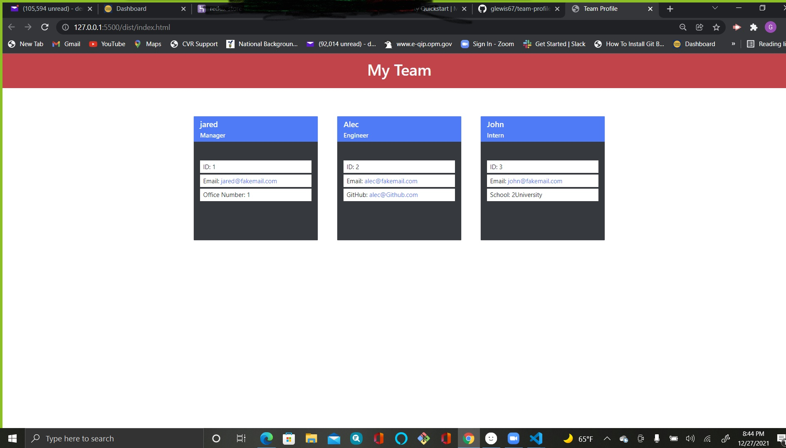

# team-profile-generater
 


## Description

* Team-profile-generater command line app that displays an
 html page on each team member.


## Desktop

https://youtu.be/G4Bbqz-cWJE




## Table of Contents

* [Stack](#stack)

* [Installation](#installation)
 
* [Deployment](#deployment)

* [Usage](#usage)

* [Questions](#questions)

* [Bugs](#bugs)

* [License](#license)

## Stack

The languages and libaries used in the application:

- Node.js
- API
- JavaScript
- CSS
- JSON


## Installation

To install necessery dependencies, follow the instruction below:

From the root directory of application ```cd``` into server folder and run this command:

```bash
npm install
```

## Deployment

* https://glewis67.github.io/team-profile-generater/

## Usage

*  The user is prompt from the command line for each question.  The code demostrate functionality being tested.
 

## Questions

For any questions regarding this application please reach out to: denen2@yahoo.com

## Bugs

Currently there are no bugs!

## License

This software is licensed under MIT license.


